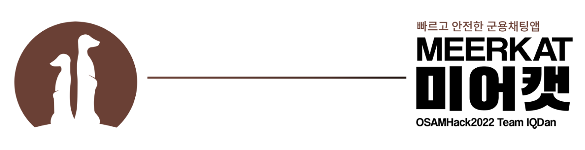

# 미어캣 - 안전한 군용 채팅앱

<p align="center">
	
</p>

<p align="center">
	<a href="https://github.com/osamhack2022/APP_Meerkat_IQDan/graphs/contributors"></a>
	<a href="https://github.com/osamhack2022/APP_Meerkat_IQDan/stargazers"></a>
	<a href="https://github.com/osamhack2022/APP_Meerkat_IQDan/issues"></a>
	<a href="https://github.com/osamhack2022/APP_Meerkat_IQDan/issues"></a>
	<a href="https://github.com/osamhack2021/WEB_Millage_ICM/blob/master/LICENSE"></a>
</p>


<p align="center">
<a href="https://github.com/osamhack2022/APP_Meerkat_IQDan/wiki">Github Wiki</a> 
| 
<a href="">Presentation</a> 
| 
<a href="">Demo Video</a>
</p>


## 프로젝트 소개 (Project Introduction)

수많은 장병들이 편의를 위해 카카오톡과 같은 서드파티 메신저앱들을 암암리에 사용하고 있습니다. 훈련 중에는 사용하지 않아도, 훈련 이후 사후 평가나 평시 명령 하달 및 보고 시 자주 사용되고 있습니다. 이런 앱들의 문제점은 군 내부의 정보들이 이러한 민간 서버들에 암호화조차 되지 않고 남을 때가 많다는 것입니다. 만약 암호화 되지 않은 정보가 적에게 유출될 시 매우 큰 약점으로 작용할 수 있습니다.

미어캣은 현재 장병들이 사용중인 채팅앱들의 대안을 마련함과 동시에 군에 특화된 채팅 기능들을 제공합니다.

## 주요 기능
### 🔐 보안 기능 
- 종단간 암호화 (End-to-end Encryption): 종단간 암호화를 통해 서버에 남기는 기록들을 암호화합니다. 서버에서도 암호화 된 내용을 알 수 없고 오로지 채팅하는 유저들끼리만 내용을 알 수 있습니다.
- 2차 비밀번호: 채팅 기록이 개인 휴대폰에 평문으로 남게되면 누군가 휴대폰을 훔쳐 내용을 보거나 스파이웨어에 의해 정보가 유출될 수 있습니다. 미어캣의 2차 비밀번호 기능을 사용하면 휴대폰에 저장되는 채팅방 내용도 암호화하여 안전하게 채팅 기록을 저장할 수 있습니다.

### 💬 채팅 기능
- 명령요약: 군에서 채팅을 할 때에 가장 중요한 것은 상급자의 명령입니다. 채팅방 마다 상급자를 설정할 수 있습니다. 명령요약을 활성화하면 해당 채팅방에 있는 상급자들의 채팅만 요약되어 보여지고 나머지 채팅들은 열고 닫을 수 있는 상태가 됩니다.
- 보고요약: 좌우로 보고를 요약해줍니다.
- 유통기한: 군의 메시지들은 유출되면 안되기에 최대한 빠르게 메시지를 삭제하도록 채팅방마다 자동 삭제 시간을 설정할 수 있습니다.  
- 충성템플릿: 여러가지 격식을 갖추거나 명령 하달 관련 템플릿을 작성/사용/공유할 수 있습니다.

## 컴퓨터 구성 / 필수 조건 안내 (Prerequisites)
* 앱 필수 요건: Android x.x 버전 이상
* 웹 필수 요건: Chrome x.x버전 이상, Firefox x.x버전 이상 

## 기술 스택 (Technology Used) 
### Frontend
- [React Native](https://reactnative.dev/) - React.js를 사용한 Cross-Platform 앱 프레임워크 
- [Expo](https://expo.dev/) - React Native 개발/배포를 쉽게 도와주는 플랫폼

### Backend
- [Node.js](https://nodejs.org/ko/) - 비동기 서버용 JavaScript 런타임
- [Express.js](https://expressjs.com/) - Node.js용 웹 애플리케이션 프레임워크
- [Socket.io](https://socket.io/) - WebSocket을 통한 실시간 통신 라이브러리
- [MariaDB](https://mariadb.org/) - MySQL에 기반을 둔 관계형 데이터베이스 관리 시스템
- [Prisma](https://www.prisma.io/) - Node.js와 Typescript를 위한 ORM (Object Relational Mapping)

### Design & Collaboration 
- [Figma](https://www.figma.com/) - 인터페이스 디자인을 위한 웹 기반 협업 툴
- [Zoom](https://zoom.us/) - 화상 회의 
- [Github](https://github.com/) - Git협업 오픈소스 플랫폼
- [Google slides](https://www.google.com/intl/ko_kr/slides/about/) - 협업 가능한 웹 기반 프레젠테이션 제작 툴

### DevOps
- [Github codespace](https://github.com/features/codespaces) - 웹 브라우저에서 돌아가는 클라우드 기반 개발 플랫폼
- [Pm2](https://pm2.keymetrics.io/) - Node.js 프로세스 매니저
- [Redis](https://redis.io/) - 메모리에서 돌아가는 Key-Value 구조 비관계형 데이터베이스 관리 시스템
- [Nginx](https://www.nginx.com/) - 가벼움과 높은 성능을 목표로하는 웹 서버
- [Letsencrypt](https://letsencrypt.org/ko/) - 무료로 TLS 인증서를 발급해주는 비영리 기관 
- [Docker](https://www.docker.com/) - 응용 프로그램들을 프로세스 격리 기술들을 사용해 컨테이너 단위로 실행하고 관리
- [Kubernetes](https://kubernetes.io/) - Docker 컨테이너들을 자동 배포, 스케일링 등을 제공하는 관리시스템

## 프로젝트 사용법 (Getting Started)
```bash
# 프로젝트 clone
git clone https://github.com/osamhack2022/APP_Meerkat_IQDan.git
```

### Backend
```bash
cd APP\(BE\)/
npm install

# docker를 이용한 MariaDB 설치
# docker 설치
sudo apt-get update && sudo apt-get upgrade
sudo curl -fsSL https://get.docker.com/ | sudo sh
sudo chmod 777 /var/run/docker.sock

# docker-compose 설치
sudo curl -L https://github.com/docker/compose/releases/download/1.26.2/docker-compose-$(uname -s)-$(uname -m) -o /usr/local/bin/docker-compose
sudo chmod +x /usr/local/bin/docker-compose
docker-compose --version 

# local 개발용 MariaDB 환경 설정
sudo chmod 755 ./EnvSetting/mariadb/conf.d/my.cnf
docker-compose -f ./EnvSetting/docker-compose.yml --env-file ./EnvSetting/.env.development.local up -d

# ENV_FILE_NAME에는 작성한 환경 설정 파일 경로를 입력합니다.
docker-compose -f ./EnvSetting/docker-compose.yml --env-file ./EnvSetting/[ENV_FILE_NAME] up -d

docker ps
docker exec -it mariadb mysql -u root -p # Enter password: password

# prisma 실행
npm run prisma:migrate:dev # mariadb dev schema에 반영

# prisma typescript type 생성
npx prisma generate

# 서버 실행
npm run dev
```

### Frontend
```bash
cd APP\(Android\)/meerkat_fe/
npm install

# sample.env.json을 env.json으로 변경 후 서버 주소를 변경 
cp sample.env.json env.json
nano env.json

# expo 실행
expo start --tunnel

# Android SDK 필요시
sudo apt update && sudo apt install android-sdk
# 아래 두 줄 .bashrc에 추가 후 터미널 재시작.
export ANDROID_HOME=/lib/android-sdk # 자신의 설치 경로 맞는지 확인할 것.
export PATH=$PATH:$ANDROID_HOME/tools/:$ANDROID_HOME/platform-tools/
```
 
## 팀 정보 (Team Information)
|이름|github|e-mail|
|---|----|----|
|이세호|[seho0808](https://github.com/seho0808)| koolee33 [at] gmail.com|
|정혜일|[hyelie](https://github.com/hyelie)|hyelie [at] postech.ac.kr|
|전형록|[exqt](https://github.com/exqt)|dashchan [at] naver.com| 
|임동진|[djlim98](https://github.com/djlim98)|ehdwlsdudwo1 [at] gmail.com|

## 저작권 및 사용권 정보 (Copyleft / End User License)
 * [MIT](https://github.com/osamhack2022/APP_Meerkat_IQDan/blob/main/license.md)

This project is licensed under the terms of the MIT license.
